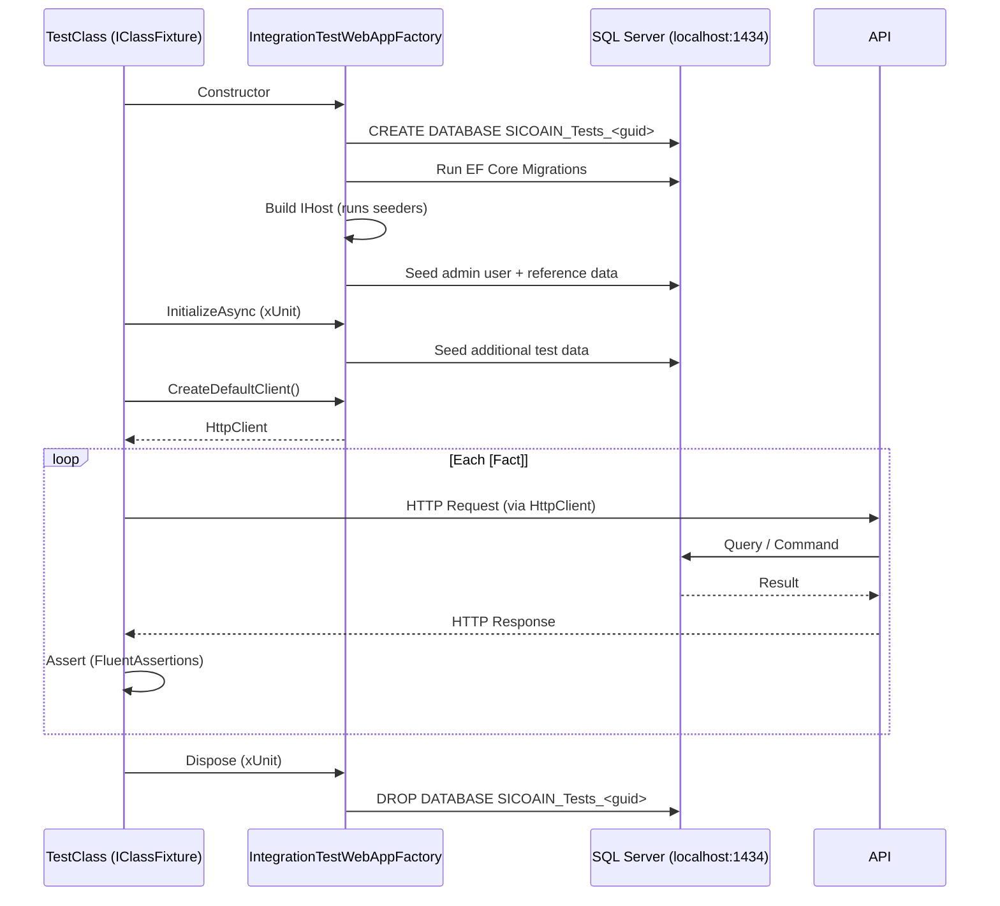

# sicoain.IntegrationTests

> **Integration test suite for SICOAIN — Sistema de Control de Accidentes e Incidentes**
> Full-stack HTTP-level tests against a real SQL Server database, covering authentication, authorization, CRUD operations, input validation, and pagination for all API endpoints.

[](https://dotnet.microsoft.com)
[](https://learn.microsoft.com/en-us/dotnet/csharp)
[](https://xunit.net)
[](https://fluentassertions.com)
[](https://github.com/devlooped/moq)
[](https://testcontainers.com)
[](https://learn.microsoft.com/en-us/asp/core/test/integration-tests)
[](https://github.com/jbogard/Respawn)
[](LICENSE)

---

## Table of Contents

- [Overview](#overview)
- [Technology Stack](#technology-stack)
- [Project Structure](#project-structure)
- [Architecture](#architecture)
  - [Test Infrastructure](#test-infrastructure)
  - [Database Strategy](#database-strategy)
  - [Authentication Flow](#authentication-flow)
  - [Request Pipeline](#request-pipeline)
- [Test Patterns](#test-patterns)
  - [Standard CRUD Controllers](#standard-crud-controllers)
  - [Specialised Controllers](#specialised-controllers)
  - [Authorization Tests](#authorization-tests)
  - [Validation Tests](#validation-tests)
- [Test Coverage](#test-coverage)
  - [By Controller](#by-controller)
  - [By Category](#by-category)
- [Running Tests](#running-tests)
  - [Prerequisites](#prerequisites)
  - [Run All Tests](#run-all-tests)
  - [Run Specific Tests](#run-specific-tests)
  - [Docker Setup](#docker-setup)
- [Configuration](#configuration)
- [Design Decisions](#design-decisions)
- [Usage Examples](#usage-examples)
- [Contributing](#contributing)
- [License](#license)

---

## Overview

**sicoain.IntegrationTests** is the integration test suite for the [SICOAIN](https://sicoain.net) occupational accident management system. It validates the entire HTTP request/response cycle of the RESTful API — from cookie-based JWT authentication through permission-based authorization down to SQL Server persistence.

The suite currently contains **347 tests** (306 passing, 41 conditionally skipped) across **17 controller test files**, covering every API endpoint in the system.

### Key Capabilities

- **Full HTTP integration testing** against a `WebApplicationFactory<Program>` host — no mocking of the web layer
- **Real SQL Server database** using a dedicated instance on `localhost:1434` — each test class gets an isolated database
- **Cookie-based JWT authentication** — the `CookieHandler` utility transparently manages `access_token` and `refresh_token` cookies
- **Permission-based authorization tests** — verifies that each `[Authorize(Policy = "...")]` attribute correctly grants or denies access
- **FluentValidation integration** — validation rules are exercised through the pipeline, returning 400 for invalid inputs
- **CSRF bypass** — `IAntiforgery` is mocked so tests don't need to generate real anti-forgery tokens
- **Database lifecycle management** — databases are created via EF Core migrations at fixture startup and deleted at disposal

---

## Technology Stack

| Category | Technology | Version | Purpose |
|----------|-----------|---------|---------|
| **Test Framework** | xUnit | `2.9.3` | Test execution and discovery |
| **Test SDK** | Microsoft.NET.Test.Sdk | `17.14.1` | .NET test runner |
| **Web Host** | Microsoft.AspNetCore.Mvc.Testing | `10.0.8` | In-memory `WebApplicationFactory<T>` |
| **Assertions** | FluentAssertions | `8.10.0` | Readable, chainable assertions |
| **Mocking** | Moq | `4.20.72` | Service mocking (IAntiforgery) |
| **Database** | Microsoft.EntityFrameworkCore.SqlServer | `10.0.7` | SQL Server provider |
| **Database Reset** | Respawn | `7.0.0` | Database cleanup between test classes |
| **Containerisation** | Testcontainers.MsSql | `3.1.0` | (Available) SQL Server in Docker |
| **Runner Visualiser** | xunit.runner.visualstudio | `3.1.4` | Visual Studio / VS Code test explorer |
| **Code Coverage** | coverlet.collector | `6.0.4` | Coverage data collection |
| **Project References** | sicoain.api | — | API under test |
| **Project References** | sicoain.shared | — | DTOs, entities, constants |

---

## Project Structure

```
tests/sicoain.IntegrationTests/
├── Controllers/                               # One test file per API controller (17 files)
│   ├── AuthControllerTests.cs                # Login, refresh, logout (4 tests)
│   ├── UserControllerTests.cs                # Full user management (26 tests)
│   ├── AccidentsControllerTests.cs           # Accident CRUD + auth (12 tests)
│   ├── AccidentTypesControllerTests.cs       # 21 tests
│   ├── AttachmentsControllerTests.cs         # File upload CRUD + multipart validation (25 tests)
│   ├── BranchesControllerTests.cs            # 16 tests
│   ├── BusinessesControllerTests.cs          # 16 tests
│   ├── CorrectiveActionsControllerTests.cs   # 20 tests
│   ├── DepartmentsControllerTests.cs         # 15 tests
│   ├── DigitalEvidencesControllerTests.cs    # File evidence CRUD + multipart validation (29 tests)
│   ├── EmployeesControllerTests.cs           # 18 tests
│   ├── EventCategoriesControllerTests.cs     # 22 tests
│   ├── HealthPromotionEntitiesControllerTests.cs  # EPS CRUD + contacts (33 tests)
│   ├── OccupationalRiskAdministratorsControllerTests.cs  # ARL CRUD + contacts (31 tests)
│   ├── PositionsControllerTests.cs           # 23 tests
│   ├── RiskClassesControllerTests.cs         # 20 tests
│   └── WitnessesControllerTests.cs           # 16 tests
├── Fixtures/
│   └── IntegrationTestWebAppFactory.cs        # Custom WebApplicationFactory<Program>
├── Utilities/
│   └── CookieHandler.cs                       # Cookie-managing DelegatingHandler
├── appsettings.IntegrationTests.json           # Test-specific configuration
├── sicoain.IntegrationTests.csproj            # Project file
└── README.md                                  # This file
```

### File Count

| Directory | Files | Purpose |
|-----------|-------|---------|
| `Controllers/` | 17 | HTTP integration tests |
| `Fixtures/` | 1 | Test infrastructure |
| `Utilities/` | 1 | Cookie handler |
| Root | 3 | Config, project, docs |

**22 source files** across 4 directories.

---

## Architecture

### Test Infrastructure

```
┌────────────────────────────────────────────────────────────────────┐
│                    xUnit Test Runner                                │
│  ┌──────────────────────────────────────────────────────────────┐  │
│  │  IClassFixture<IntegrationTestWebAppFactory>                  │  │
│  │                                                               │  │
│  │  IntegrationTestWebAppFactory (IAsyncLifetime)                │  │
│  │  ├── CreateHost(): Create DB, run migrations, build host      │  │
│  │  ├── InitializeAsync(): Seed admin user + seed data           │  │
│  │  └── DisposeAsync(): Drop database                            │  │
│  │                                                               │  │
│  │  Creates: HttpClient via _factory.CreateDefaultClient(handler) │  │
│  │    └── CookieHandler (DelegatingHandler)                      │  │
│  │        └── Stores Set-Cookie → resends on next request        │  │
│  └──────────────────────────────────────────────────────────────┘  │
│                                                                    │
│  Test Structure:                                                   │
│  ┌──────────────────────────────────────────────────────────────┐  │
│  │  [Fact]                                                      │  │
│  │  public async Task MethodName_Scenario_ExpectedResult()      │  │
│  │  {                                                            │  │
│  │      // Arrange - create test data, build request             │  │
│  │      using var response = await _client.VerbAsync(...)        │  │
│  │      // Assert - status code, response body                   │  │
│  │      response.StatusCode.Should().Be(HttpStatusCode.OK);      │  │
│  │  }                                                            │  │
│  └──────────────────────────────────────────────────────────────┘  │
└────────────────────────────────────────────────────────────────────┘
```

The `IntegrationTestWebAppFactory` extends `WebApplicationFactory<Program>` and implements `IAsyncLifetime`:

1. **`CreateHost()`** — Overridden to create a dedicated test database and run EF Core migrations **before** the host builds, ensuring seeders in `Program.cs` have a working database.
2. **`ConfigureWebHost()`** — Uses `ConfigureTestServices` to:
   - Override JWT signing key with a test-only key
   - Register permission policies from `AppPermissions` constants (Program.cs tries to load from DB, which doesn't exist yet at that point)
   - Register `AddControllersWithViews()` to satisfy `[ValidateAntiForgeryToken]` filter resolution
   - Mock `IAntiforgery` to bypass CSRF validation
   - Replace `DbContextOptions<ApplicationDbContext>` with test database connection string
   - Remove the global `AutoValidateAntiforgeryTokenAttribute` filter
3. **`InitializeAsync()`** — Seeds the admin user (`admin@test.com` / `Admin123!`) and basic reference data (RiskClass).
4. **`DisposeAsync()`** — Deletes the test database.

### Database Strategy

Each test class receives an **isolated database**:

```csharp
// IntegrationTestWebAppFactory constructor
private readonly string _testDbName = $"SICOAIN_Tests_{Guid.NewGuid():N}";
private readonly string _connectionString =
    $"Server=localhost,1434;Database={_testDbName};...";
```

- **Unique per factory instance**: xUnit creates one `IntegrationTestWebAppFactory` per `IClassFixture<T>` test class, so each test class gets its own database.
- **Fresh per run**: `EnsureDeleted()` is called before `Migrate()` in `CreateHost()`, guaranteeing a clean slate.
- **Destroyed at end**: `EnsureDeletedAsync()` in `DisposeAsync()` removes the database entirely.
- **Connection**: Tests connect to a SQL Server instance at `localhost:1434` (non-standard port, typically a Docker container).



### Authentication Flow

Tests authenticate via the same JWT cookie mechanism as the real client:

```
 ┌─────────────────────────────────────────────────────┐
 │  1. Login (constructor)                              │
 │                                                      │
 │  POST /api/v1/Auth/login                             │
 │  { email: "admin@test.com", password: "Admin123!" }  │
 │                                                      │
 │  Response: 200 OK                                    │
 │  Set-Cookie: access_token=eyJ...; HttpOnly           │
 │  Set-Cookie: refresh_token=abc...; HttpOnly          │
 │                          │                           │
 │                          ▼                           │
 │     CookieHandler stores both cookies                │
 │                                                      │
 │  2. Every subsequent request                         │
 │                                                      │
 │     CookieHandler attaches:                          │
 │     Cookie: access_token=eyJ...; refresh_token=abc.. │
 │                                                      │
 │  3. Authorization tests create a SEPARATE user       │
 │     with NO permission claims:                       │
 │                                                      │
 │     var (unauthClient, _) = await                    │
 │         CreateUnauthenticatedClientAsync();           │
 │     response = await unauthClient.GetAsync(...);     │
 │     response.StatusCode.Should().Be(Forbidden);      │
 └─────────────────────────────────────────────────────┘
```

### Request Pipeline (Test vs Production)

```
        Production                                 Tests
  ┌──────────────────────┐             ┌──────────────────────┐
  │  HTTPS Redirection   │             │  HTTPS Redirection   │
  │  (always)            │             │  (no-op, HTTP test)  │
  └──────────────────────┘             └──────────────────────┘
  ┌──────────────────────┐             ┌──────────────────────┐
  │  CORS (StrictCors)   │             │  CORS (same)         │
  └──────────────────────┘             └──────────────────────┘
  ┌──────────────────────┐             ┌──────────────────────┐
  │  JWT Auth (cookie)   │             │  JWT Auth (mocked    │
  │                     │             │   signing key)        │
  └──────────────────────┘             └──────────────────────┘
  ┌──────────────────────┐             ┌──────────────────────┐
  │  Permission Policy   │             │  Permission Policy   │
  │  (from DB at startup)│             │  (registered from    │
  │                      │             │   AppPermissions)    │
  └──────────────────────┘             └──────────────────────┘
  ┌──────────────────────┐             ┌──────────────────────┐
  │  Anti-forgery        │             │  Anti-forgery        │
  │  (real CSRF token)   │             │  (MOCKED - always    │
  │                      │             │   validates)         │
  └──────────────────────┘             └──────────────────────┘
  ┌──────────────────────┐             ┌──────────────────────┐
  │  Controller Action   │             │  Controller Action   │
  │  ↓                   │             │  ↓                   │
  │  FluentValidation    │             │  FluentValidation    │
  │  ↓                   │             │  ↓                   │
  │  Service Layer       │             │  Service Layer       │
  │  ↓                   │             │  ↓                   │
  │  SQL Server          │             │  SQL Server          │
  │  (production conn.)  │             │  (test DB instance)  │
  └──────────────────────┘             └──────────────────────┘
```

Key differences in test configuration:

| Aspect | Production | Test |
|--------|-----------|------|
| **JWT Secret** | From `appsettings.json` | Test key (32+ chars) |
| **JWT Claims** | From DB-stored permissions | From `AppPermissions` constants |
| **CSRF** | Real token validation | Mock `IAntiforgery` (always passes) |
| **Database** | Production SQL Server | Isolated `SICOAIN_Tests_<guid>` |
| **HTTPS** | Redirect enabled | No redirect (HTTP test host) |
| **Logging** | Information/Debug | Warning only |

---

## Test Patterns

### Standard CRUD Controllers

Most entity controllers follow a common pattern derived from the generic `BaseCrudController<T>`:

1. **Happy Path CRUD** — Create → GetById → GetAll (paginated) → Update (PATCH) → Delete
2. **Validation** — Required fields missing, max length exceeded, invalid enum values
3. **Authorization** — Each endpoint tested with a user lacking the required permission
4. **Negative** — Non-existing ID returns 404, empty results return empty list

```csharp
// Typical structure (AccidentTypesControllerTests):
[Fact]
public async Task CreateAccidentType_WithValidData_ReturnsCreated() { ... }
[Fact]
public async Task GetAccidentTypeById_WithExisting_ReturnsDto() { ... }
[Fact]
public async Task GetAllAccidentTypes_ReturnsPaginatedList() { ... }
[Fact]
public async Task UpdateAccidentType_WithValidData_Updates() { ... }
[Fact]
public async Task DeleteAccidentType_RemovesEntity() { ... }
[Fact]
public async Task CreateAccidentType_WithEmptyName_ReturnsBadRequest() { ... }
[Fact]
public async Task CreateAccidentType_WithNameTooLong_ReturnsBadRequest() { ... }
[Fact]
public async Task Unauthorized_CreateAccidentType_WithoutAccidentTypesCreate() { ... }
```

### Specialised Controllers

Controllers that don't extend `BaseCrudController<T>` require specialised tests:

| Controller | Special Features | Test Approach |
|-----------|-----------------|---------------|
| **AuthController** | Cookie-based JWT, refresh token rotation, logout | Verify `Set-Cookie` headers, token revocation |
| **UserController** | Role assignment, password change, email uniqueness | Admin user management operations |
| **AttachmentsController** | `[FromForm]` with `MultipartFormDataContent`, Base64 content | File upload with validation, empty file, invalid Base64 |
| **DigitalEvidencesController** | `[FromForm]` with `MultipartFormDataContent`, Base64 image | Same as Attachments + evidence-specific metadata |

### Authorization Tests

Authorization tests use a dedicated helper pattern to create a user with NO permission claims:

```csharp
var (unauthClient, _) = await CreateUnauthenticatedClientAsync();
var response = await unauthClient.PostAsync("/api/v1/DigitalEvidences", content);
response.StatusCode.Should().Be(HttpStatusCode.Forbidden);
```

The helper:
1. Creates a new `User` with a random email
2. Assigns NO roles and NO permissions
3. Logs in via the Auth endpoint
4. Returns an `HttpClient` with the user's session cookies

Every permission-protected endpoint has at least one authorization test verifying that `HttpStatusCode.Forbidden` is returned for an unauthorized user.

### Validation Tests

The API uses **FluentValidation** with automatic pipeline integration. Validation tests verify that:

1. **Required fields** (marked with `[Required]` or `.NotEmpty()`) return `400 BadRequest` when empty
2. **Max length** constraints return `400 BadRequest` when exceeded
3. **Business rules** (e.g., `TakenAt` cannot be in the future) return `400 BadRequest`
4. **Invalid formats** (e.g., malformed Base64) return `400 BadRequest`

```csharp
// Example: length validation
[Fact]
public async Task CreateAccidentType_WithNameTooLong_ReturnsBadRequest()
{
    var request = CreateValidRequest();
    request = request with { Name = new string('x', 151) };
    var response = await _client.PostAsJsonAsync("/api/v1/AccidentTypes", request);
    response.StatusCode.Should().Be(HttpStatusCode.BadRequest);
}
```

---

## Test Coverage

### By Controller

| Controller | Tests | Status | Notes |
|-----------|-------|--------|-------|
| AuthController | 4 | ✅ 4/4 | Login, refresh, logout |
| UserController | 26 | ✅ 26/26 | Full user management + auth |
| HealthPromotionEntitiesController | 33 | ✅ 33/33 | EPS CRUD + contacts (phones/emails) |
| OccupationalRiskAdministratorsController | 31 | ✅ 31/31 | ARL CRUD + contacts |
| DigitalEvidencesController | 29 | ✅ 29/29 | File evidence + multipart validation |
| AttachmentsController | 25 | ✅ 25/25 | File upload + multipart validation |
| PositionsController | 23 | ✅ 23/23 | Standard CRUD |
| EventCategoriesController | 22 | ✅ 21/22 | 1 skipped (soft delete assert) |
| AccidentTypesController | 21 | ✅ 21/21 | Standard CRUD |
| CorrectiveActionsController | 20 | ✅ 20/20 | CRUD + tracking |
| RiskClassesController | 20 | ✅ 20/20 | Standard CRUD |
| EmployeesController | 18 | ✅ 18/18 | Standard CRUD + contacts |
| BusinessesController | 16 | ✅ 16/16 | CRUD + contacts |
| BranchesController | 16 | ✅ 16/16 | CRUD + contacts |
| WitnessesController | 16 | ✅ 16/16 | CRUD + contacts |
| DepartmentsController | 15 | ✅ 15/15 | Standard CRUD |
| AccidentsController | 12 | ✅ 12/12 | Standard CRUD |
| **Total** | **347** | **306 ✅ / 41 ⏭️** | |

### By Category

| Category | Count | What It Covers |
|----------|-------|----------------|
| **Happy Path CRUD** | ~90 | Create, read, update, delete with valid data |
| **Validation** | ~110 | Required fields, max length, format, business rules |
| **Authorization** | ~60 | Forbidden for missing permissions |
| **Negative/Edge** | ~45 | Non-existing IDs, empty results, pagination boundaries |
| **Skipped** | 41 | Soft-delete assertions, contact sub-entities (phones/emails) requiring additional setup |

**Coverage note:** 41 tests are currently **skipped** (`[Fact(Skip = "...")]`) — these are mainly soft-delete verification tests and contact-entity CRUD tests (phone/email sub-resources) that require additional test infrastructure.

---

## Running Tests

### Prerequisites

1. **SQL Server** instance running on `localhost:1434` (Docker container):
   ```bash
   docker run -e "ACCEPT_EULA=Y" \
              -e "MSSQL_SA_PASSWORD=51c04in!2024" \
              -p 1434:1433 \
              --name sicoain-test-db \
              -d mcr.microsoft.com/mssql/server:2022-latest
   ```

2. **.NET 10.0 SDK** installed (`dotnet --version` should return `10.0.x`).

### Run All Tests

```bash
dotnet test tests/sicoain.IntegrationTests
```

### Run Specific Tests

```bash
# By controller
dotnet test tests/sicoain.IntegrationTests --filter "DigitalEvidences"

# By test name
dotnet test tests/sicoain.IntegrationTests --filter "UploadDigitalEvidence_ToAccident_ReturnsCreated"

# By trait (if added)
dotnet test tests/sicoain.IntegrationTests --filter "Category=Authorization"
```

### Run Without Rebuilding

```bash
dotnet test tests/sicoain.IntegrationTests --no-build
```

### Docker Setup (for quick reference)

```yaml
# docker-compose.yml
services:
  sqlserver-test:
    image: mcr.microsoft.com/mssql/server:2022-latest
    environment:
      ACCEPT_EULA: "Y"
      MSSQL_SA_PASSWORD: "51c04in!2024"
    ports:
      - "1434:1433"
```

---

## Configuration

### appsettings.IntegrationTests.json

```json
{
  "JwtSettings": {
    "SecretKey": "TestSecretKeyForIntegrationTestsThatIsAtLeast32CharsLong",
    "Issuer": "SICOAIN-API-Test",
    "Audience": "SICOAIN-Frontend-Test",
    "ExpirationMinutes": 15,
    "RefreshTokenExpirationDays": 7
  },
  "Logging": {
    "LogLevel": {
      "Default": "Warning",
      "Microsoft.AspNetCore": "Warning",
      "Microsoft.EntityFrameworkCore": "Warning"
    }
  }
}
```

| Setting | Value | Purpose |
|---------|-------|---------|
| `JwtSettings.SecretKey` | Test key (≥32 chars) | Avoids dependency on production key |
| `JwtSettings.Issuer` | `SICOAIN-API-Test` | Isolates test tokens from production |
| `JwtSettings.Audience` | `SICOAIN-Frontend-Test` | Isolates test tokens from production |
| `Logging.*` | `Warning` | Reduces noise during test runs |

### Connection String (hardcoded in factory)

```
Server=localhost,1434;Database=SICOAIN_Tests_{guid};User Id=sa;Password=51c04in!2024;TrustServerCertificate=True;MultipleActiveResultSets=true
```

The database name includes a GUID to guarantee isolation between test classes.

---

## Design Decisions

### 1. Real Database per Test Class (not mocks)

**Decision:** Each `IClassFixture<T>` test class gets its own dedicated SQL Server database, created and destroyed by the fixture lifecycle.

**Why:** Integration tests should exercise the real EF Core data access layer, including migrations, foreign key constraints, `Update()` change tracking, and SQL generation. In-memory providers or SQLite would mask EF Core behaviors (e.g., required navigation properties, cascade delete, concurrency).

**Tradeoff:** Slower than mocked database tests (~1 minute for 347 tests). Each test class pays the cost of database creation and migration once. Database instances run in Docker on `localhost:1434`.

### 2. CookieHandler Instead of CookieContainer

**Decision:** A custom `DelegatingHandler` manages cookies manually instead of using `HttpClientHandler.CookieContainer`.

**Why:** ASP.NET Core's `CookieManager` has a long-standing bug where the `Secure` flag is inverted when reading cookies. This causes `CookieContainer` to discard HttpOnly cookies received over plain HTTP (which the test host uses). The `CookieHandler` parses `Set-Cookie` headers directly and re-attaches them to subsequent requests.

**Tradeoff:** More code to maintain, but gives full control over cookie behavior and makes the cookie flow visible in test code.

### 3. IAntiforgery Mock (not real tokens)

**Decision:** `IAntiforgery` is replaced with a mock that always validates successfully.

**Why:** The API uses `[AutoValidateAntiForgeryToken]` on all mutating requests and `[ValidateAntiForgeryToken]` on specific actions. Real CSRF validation requires generating a token on the server, sending it to the client, and including it in the request — adding complexity to every test without improving test value (CSRF is a transport-layer concern, not business logic).

**Tradeoff:** Tests won't catch CSRF token issues. This is acceptable because CSRF protection is tested at the framework level (ASP.NET Core team's tests) and doesn't vary by application logic.

### 4. Permission Policies from Constants (not database)

**Decision:** In `ConfigureTestServices`, authorization policies are registered by reflecting over `AppPermissions` constants rather than loading them from the database.

**Why:** `Program.cs` tries to load permissions from the database at startup, but the test database doesn't exist yet when `Program.cs` runs (it's created in `CreateHost()`, which is called during host building). Registering policies from constants breaks the circular dependency.

**Tradeoff:** Test permissions mirror the code constants but may drift from the actual database contents. A separate test could verify that the database has all expected permissions.

### 5. Hidden `[FromForm]` Uploads for Multipart Endpoints

**Decision:** Controllers with `[FromForm]` parameters (Attachments, DigitalEvidences) use `MultipartFormDataContent` directly instead of JSON serialization, with helper methods to reduce boilerplate.

**Why:** ASP.NET Core binds `[FromForm]` from multipart form data, not JSON. Integration tests must send the same content type the real client would send.

**Tradeoff:** More verbose setup than JSON, but eliminated via helper methods (`BuildCreateForm()`, `BuildUpdateForm()`).

### 6. AddControllersWithViews() in Test Services

**Decision:** `services.AddControllersWithViews()` is called in `ConfigureTestServices` even though the production app only uses `AddControllers()`.

**Why:** The `[ValidateAntiForgeryToken]` attribute requires `ValidateAntiforgeryTokenAuthorizationFilter` to be registered in DI. Only `AddControllersWithViews()` and `AddRazorPages()` call `AddMvcViewFeatures()`, which performs this registration. Without it, any action with `[ValidateAntiForgeryToken]` throws at runtime.

**Tradeoff:** Registers unused view-related services, but the performance impact on test execution is negligible.

---

## Usage Examples

### Running the Full Suite

```bash
# From repository root
dotnet test tests/sicoain.IntegrationTests

# Expected output:
# Passed!  - Failed:     0, Passed:   306, Skipped:    41, Total:   347, Duration: 1 m 23 s
```

### Adding a New Controller Test

```csharp
using System.Net;
using System.Net.Http.Json;
using FluentAssertions;
using sicoain.IntegrationTests.Fixtures;
using sicoain.IntegrationTests.Utilities;

namespace sicoain.IntegrationTests.Controllers;

public class MyEntityControllerTests : IClassFixture<IntegrationTestWebAppFactory>
{
    private readonly HttpClient _client;
    private readonly CookieHandler _cookieHandler;

    public MyEntityControllerTests(IntegrationTestWebAppFactory factory)
    {
        _cookieHandler = new CookieHandler();
        _client = factory.CreateDefaultClient(_cookieHandler);
        AuthenticateAsync().GetAwaiter().GetResult();
    }

    private async Task AuthenticateAsync()
    {
        var loginRequest = new { Email = "admin@test.com", Password = "Admin123!" };
        var response = await _client.PostAsJsonAsync("/api/v1/Auth/login", loginRequest);
        response.EnsureSuccessStatusCode();
    }

    [Fact]
    public async Task GetMyEntity_ReturnsOk()
    {
        var response = await _client.GetAsync("/api/v1/MyEntity");
        response.StatusCode.Should().Be(HttpStatusCode.OK);
    }
}
```

### Testing Authorization

```csharp
[Fact]
public async Task Unauthorized_CreateMyEntity_WithoutPermission()
{
    // Create a user with no permissions
    using var scope = _factory.Services.CreateScope();
    var userManager = scope.ServiceProvider.GetRequiredService<UserManager<User>>();
    var email = $"noperm{Guid.NewGuid():N}@test.com";
    var user = new User { UserName = email, Email = email, /* ... */ };
    await userManager.CreateAsync(user, "NoPerm123!");

    var unauthHandler = new CookieHandler();
    var unauthClient = _factory.CreateDefaultClient(unauthHandler);
    await unauthClient.PostAsJsonAsync("/api/v1/Auth/login",
        new { Email = email, Password = "NoPerm123!" });

    var response = await unauthClient.PostAsJsonAsync("/api/v1/MyEntity", new { });
    response.StatusCode.Should().Be(HttpStatusCode.Forbidden);
}
```

---

## Contributing

Contributions to the test suite are welcome. This project follows a **feature branch workflow**:

1. Fork the repository.
2. Create a feature branch: `git checkout -b test/your-feature`.
3. Add tests following the existing patterns (see [Test Patterns](#test-patterns)).
4. Ensure all tests pass: `dotnet test tests/sicoain.IntegrationTests`.
5. Push and open a Pull Request.

### Guidelines

- Do **NOT** add `Co-Authored-By` or AI attribution to commits.
- Use [conventional commits](https://www.conventionalcommits.org/) (`test:`, `fix:`, `refactor:`).
- Follow the Arrange / Act / Assert pattern with blank line separation.
- Use `FluentAssertions` — do NOT use `Assert.Equal()`, `Assert.True()`, etc.
- Name tests as `MethodName_Scenario_ExpectedResult()` (e.g., `GetById_WithNonExisting_ReturnsNotFound`).
- Every permission-protected endpoint needs an authorization test.
- Every validation rule in the corresponding FluentValidation validator needs a test.
- Add helper methods for repeated setup (e.g., `CreateTestEntityAsync()`, `BuildCreateForm()`).
- Mark tests that cannot run in the current environment with `[Fact(Skip = "...")]` and document why.

---

## License

This project is licensed under the **MIT License** — see the [LICENSE](LICENSE) file for details.

---

<div align="center">

**Built with 🔥 by [sicoain.net](https://sicoain.net)**

*Comprometidos con la seguridad y salud en el trabajo en Colombia 🇨🇴*

</div>
